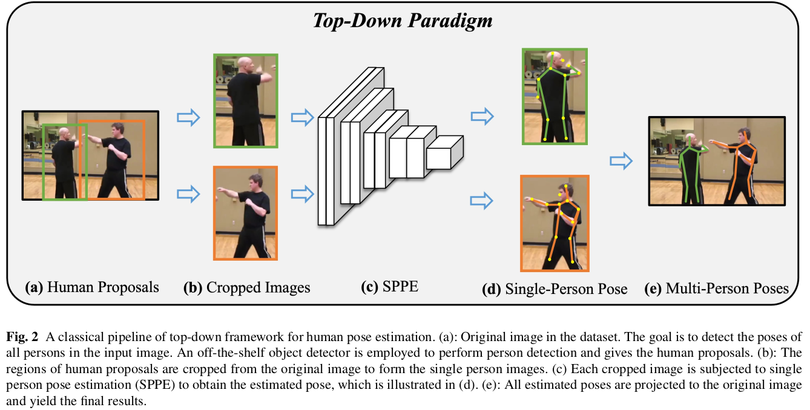

# [Review] 2D Human Pose Estimation: A Survey
H Chen, R Feng, S Wu, H Xu, F Zhou, Z Liu - Multimedia systems, 2023 - Springer

> **Keywords** : Human pose estimation, pose estimation survey, deeplearning, convolutional neural network

## 1. Introduction

</img>

#### The Goal of HPE

1. 다양한 데이터 환경에서 사람을 찾는 것

2. 각 사람들에게서 keypoints를 찾아내는 것 

        
#### Three Categories of Human Pose Estimation

1. Network architecture design

2. Network training refinement 

3. Post processing 

 

## 2. Problem Statement
**HPE 목표** : ***입력된 이미지 내의 모든 사람들의 포즈를 추론하는 것***

#### Challenges
1. 실제 환경에서는 과·소노출이나 사람-사물 얽힘과 같은 잡음 현상이 자주 발생하며, 이는 쉽게 탐지 실패로 이어질 수 있다.

2. 인간의 운동 사슬은 매우 유연하기 때문에, 많은 상황에서 자세 가림(occlusion)이나 자기 가림(self-occlusion)이 불가피하며, 이는 시각적 특징을 사용하는 키포인트 검출기를 더욱 혼란스럽게 만든다.

3. 모션 블러나 초점 흐림(defocus)은 영상에서 자주 나타나며, 이는 자세 추정의 정확도를 저하시킨다.

 

## 3. Network Architecture Design Methods

Pose Estimation 네트워크 구조는 크게 2개 (**top-down, bottom-up**) 로 나뉜다. 

#### Top-Down 
</img>

    1. 사람의 bounding box를 먼저 탐지
    2. 각 bounding box에 대해 단일 인물의 자세 추정을 수행함 

- **Top-Down Approaches**
  
    - regression-based
    - heatmap-based
    - video-based
    - model compressing-based

#### Bottom-Up

    1. 이미지 내에서 모든 키포인트들을 검출
    2. 이후, 서로 다른 사람의 인스턴스로 그룹화 진행

- **Bottom-Up Approaches**
  
    - one stage
    - two stage

 

### 3.1 Top-Down Framework
### 3.1.1 Regression-Based Methods

회귀 기반(regression-based) 접근법은 입력 이미지에서 인간의 운동학적 관절 좌표를 직접 회귀(regress) 하는 방식으로, 초기 연구들은 end-to-end 네트워크를 통해 이미지에서 키포인트 좌표를 바로 예측하는 모델을 제안함.

#### 초기 모델과 발전

- DeepPose [161]

    - AlexNet 기반 CNN으로 이미지 특징을 반복적으로 추출한 뒤 FC layer로 관절 좌표를 회귀.

    - 이 연구를 계기로 기존 전통 기법에서 딥러닝 기반 방식으로 전환이 가속됨.

#### 후속 연구

- Human pose estimation with iterative error feedback.

    - GoogleNet 기반 self-correcting 모델: 관절 위치를 직접 예측하지 않고 점진적으로 수정하는 방식 제안.

- Compositional human pose regression

    - 구조 정보를 활용한 regression 방식: 뼈(bone) 기반 재파라미터화된 포즈 표현을 사용하여 구조적 정보를 더 잘 반영.

- Semi-supervised classification with graph convolutional networks

    - GCN 기반 접근

    - 인체를 그래프로 모델링(노드=관절, 엣지=뼈)
    
    - 이미지 가이드를 활용해 보이지 않는 관절도 추정하는 Progressive GCN 모듈 제안.

- Pose recognition with cascade transformers

     - Transformer 기반 접근

     - Cascaded Transformer 구조로 사람 검출 → 각 인물의 관절 좌표 회귀를 end-to-end로 수행.

#### 장점과 한계

- 장점

    - **연산 효율이 높고, 실시간(real-time) 응용 가능성이 큼**.

- 한계

    - 각 관절을 단일 2D 좌표로 직접 출력하기 때문에 부위 영역(body part area)에 대한 **불확실성을 고려하지 못함**.

- 이를 보완하기 위해, 이후에는 **확률적 히트맵 기반(heatmap-based)** 방식이 도입되어 키포인트를 픽셀 단위 확률 분포로 예측하는 방법이 등장함.

 

### 3.1.2 Heatmap-Based Methods

- 좌표를 직접 회귀하는 방식의 한계를 극복하기 위해 Heatmap-Based 방식이 사용됨 
- 각 관절 위치를 중심으로 한 2D Gaussian 분포 히트맵을 생성하여 위치 확률을 모델링함
- 학습 시 N개의 관절에 대해 N개의 히트맵을 예측하는 방식
- 최적화가 쉬워지고 일반화 성능이 높아짐

#### 주요 접근 방식

***1. Iterative Architecture***

</img>

- Iterative architecture는 키포인트 히트맵을 여러 단계에 걸쳐 생성 → 정제(refine) 하는 구조임.

- 각 스테이지는 이전 스테이지의 출력(heatmap)을 기반으로 더 정교한 예측을 수행함.

- **핵심 아이디어**

    - 다단계 예측(multi-stage refinement) \
    → 관절 위치를 한 번에 예측하는 것이 아니라, 점진적으로 개선해 나가는 방식임.

    - 인간 몸의 장거리 의존성(long-range spatial dependency) 을 처리하기 위한 sequential conv 등이 활용됨.

- **주요 연구**

    - Pose machines: Articulated pose estimation via inference machines
        - Inference Machine Model 

        - 관절 위치를 여러 단계에서 점진적으로 추론하는 구조 제안함.

        - 각 단계는 이전 단계의 결과를 바탕으로 더 나은 추론 수행함.

    - Convolutional pose machines (Pose machines의 확장)

        - Sequential Prediction Framework 

        - 순차적 convolution으로 인체 부위 간 장거리 관계를 암묵적으로 모델링함.

        - 이전 stage 출력을 기반으로 점점 더 refined된 joint 위치 예측함.

        - Intermediate supervision 도입해 multi-stage 구조의 gradient vanishing 문제를 완화함.

- **한계** 
    
    - 중간 supervision 추가해도 각 stage가 깊은 semantic feature를 학습하는 데 한계 있음.

    - 결과적으로 모델의 fitting capacity가 충분하지 않음.

- **Residual network의 영향**

    - ResNet이 도입되어 shortcut connection을 통해 deep layer에서도 gradient가 안정적으로 전파 가능해짐.

    - 이로 인해 iterative 구조가 가지던 깊이의 한계 문제 해결됨.

 

---

</img>

***2. Symmetric Architecture***

- 대부분의 딥러닝 기반 포즈 추정 모델은 High → Low (Downsampling), Low → High (Upsampling) 구조를 사용함.

- 여기서 high/low는 feature resolution을 의미함.

- 대표 구조: Stacked Hourglass Network (**Fig. 4(a)** 참고)

- **Stacked Hourglass Architecture**

    - 연속적인 pooling(다운샘플링)과 upsampling(업샘플링) 단계를 반복해 다양한 스케일의 특징을 통합함.

    - 인체 관절 간 다양한 공간적 관계(spatial relationships) 를 효과적으로 포착함.

    - 이후 여러 파생 모델의 기반이 됨.

- **주요 연구** 

    - Multi-context attention for human pose estimation

        - Hourglass Residual Units

        - 기존 hourglass에 큰 receptive field 를 가지는 side-branch 추가

        - 더 넓은 범위의 공간 정보를 학습하고 멀티 스케일 특징 학습 능력 강화

    - Learning feature pyramids for human pose estimation

        - Pyramid Residual Module
        
        - 기존 residual block을 Pyramid Residual Module 로 대체

        - 네트워크의 scale invariance(크기 변화에 대한 강건성) 향상

        - 다양한 스케일의 관절 패턴을 효과적으로 처리함

    - Multi-scale structure-aware network for human pose estimation

        - Multi-scale supervision
        
        - 모든 스케일의 heatmap에 supervision 제공

        - 풍부한 컨텍스트 정보를 확보하고 hourglass 성능을 효과적으로 증대시킴

    - Learning delicate local representations for multi-person pose estimation

        - Residual Steps Network

        - hourglass와 유사한 구조

        - 같은 resolution을 가진 특징들을 단계적으로 결합해 정교한 지역적 표현(localized representation) 생성

    - Does learning specific features for related parts help human pose estimation?

        - Part-based branching 

        - Hourglass [122]를 backbone으로 사용함

        - 신체 부위(part group)별로 분기(branch)하여 부위 특화 표현(part-specific representation) 학습

        - 복잡한 관절 상관관계를 더 잘 모델링함

- **구조적 특징** 

    - 위 모델들은 모두 대칭 구조(symmetric architecture) 를 유지함\
    → Downsampling 경로와 Upsampling 경로가 서로 mirroring됨

    - 이 구조는 다양한 스케일까지의 정보 재수집과 통합을 가능하게 함\
    → 즉, 정확한 keypoint localization에 매우 효과적

 

***3. Asymmetric Architecture***

- Asymmetric architecture는 High → Low(다운샘플링) 경로는 무겁게, Low → High(업샘플링) 경로는 가볍게 설계하는 비대칭 구조임.

- Symmetric (Hourglass)와 달리 양쪽 경로의 모델 복잡도가 다름.

- 고수준의 특징(feature)을 뽑는 과정은 깊고 복잡하게 다시 해상도를 복원하는 과정은 간단한 구조로 수행 \
→ 효율성을 얻기 위한 설계 방향

- **주요 연구**

    - Cascaded Pyramid Network (**Fig. 4(c)** 참고)

        - GlobalNet: 쉬운 키포인트(좁은 receptive field로도 충분한 부위) 탐지

        - RefineNet: 어려운 키포인트 처리

            - 여러 레벨의 feature를 통합

            - regular convolution으로 구성

        - pyramid 구조 기반으로 정교한 포즈 추정 가능

    - Simple baselines for human pose estimation and tracking

        - ResNet + deconv 사용해 upsample 수행 (**Fig. 4(b)** 참고)

        - ResNet 백본에 deconvolution layer 여러 개 추가

        - 기존의 feature map upsampling(interpolation)보다 더 풍부한 high-resolution feature 복원 가능

- **일반적인 구조적 특징** 

    - High → Low 경로는 ResNet, VGG 등 대형 classification backbone 사용

    - Low → High 경로는 단순한 conv 또는 deconv 몇 개만 사용\
    → 두 경로의 비대칭성이 명확함

- **한계**

    - 인코딩(High→Low)과 디코딩(Low→High) 과정이 균형 잡혀 있지 않음

    - 이 불균형이 feature 품질에 영향을 줘 결국 전체 pose estimation 성능 저하 가능성 있음

 

***4. High Resolution Architecture***

- 기존 모델들은 대부분 downsampling → upsampling 구조를 사용하면서 중간 과정에서 고해상도 정보가 손실되는 문제가 있었음.

- HRNet은 이 문제를 해결하기 위해 전체 과정에서 고해상도 feature를 유지하는 구조 제안함.

- 여러 비전 작업에서 SOTA 달성하며 인체 자세 추정(HPE) 분야에도 큰 영향을 줌.

- **핵심 개념**

    - High-resolution feature stream을 끝까지 유지하는 것이 HRNet의 핵심임.

    - 멀티해상도 스트림을 병렬로 유지하면서 서로 반복적으로 정보 교환(fusion)함.

    - 이를 통해 정교한 spatial 정보를 보존하고 정확한 keypoint localization 가능해짐.

- **Deep high resolution representation learning for human pose estimation** (HRNet, **Fig. 4(d)** 참고)

    - 네트워크 전반에 걸쳐 high-res feature를 유지하는 대표 모델.

    - HPE뿐 아니라 segmentation, detection 등 다양한 비전 작업에서 탁월한 성능 보임.

    - Hourglass와 달리 down→up 루프를 반복하지 않음.

    - 멀티-branch 병렬 구조로 고·중·저 해상도 feature를 동시에 처리하며 fusion함.

- **주요 연구**

    - Pay attention selectively and comprehensively: Pyramid gating network for human pose estimation without pre-training

        - HRNet을 backbone으로 사용

        - Gating mechanism + feature attention module 추가해 중요한 특징만 선택적으로 활용하도록 개선함

        - attention-aware feature fusion 가능해짐

    - 기타 후속 연구들 

        - 고해상도 표현을 강화하는 다양한 변형 모델 등장

        - HRNet 구조의 멀티해상도 병렬 처리 아이디어를 확장하거나 task-specific 모듈 추가함

- **HRNet의 장점**

    - 정확한 keypoint localization\
    → high-resolution feature 유지 덕분

    - multi-scale 정보의 지속적 통합

    - robust한 표현 학습

    - symmetric/asymmetric 구조 대비 feature degradation이 적음

- **한계**

    - 병렬 branch 유지로 인해 메모리 사용량 증가

    - 모델 크기와 연산량도 상대적으로 높음\
    → 실제 deployment 시 최적화 필요

 

***5. Composed Human Proposal Detection***

- 기존 heatmap 기반 자세 추정 모델들은 대부분 사람 proposal(bbox)을 외부 detector로부터 받아 사용함.

- 하지만 proposal 품질(위치 정확도, 중복 탐지 등) 이 최종 pose accuracy에 큰 영향을 미침.

- 이를 해결하기 위해 두 방향으로 발전함.
    - (1) proposal 품질을 개선하는 연구,
    - (2) proposal detection + pose estimation을 joint하게 수행하는 연구

 

> **Approach 1: Proposal 품질 향상 기반 접근**

- **주요 연구**

    - Towards accurate multi-person pose estimation in the wild
        
        - Faster-RCNN + Keypoint NMS

        - Faster-RCNN으로 사람 검출

        - ResNet-101으로 pose 추정

        - pose redundancy 해결 위해 keypoint NMS 제안함
            → 중복 포즈 문제 완화

    - Regional multi-person pose estimation
    
        - Spatial Transformer Network로 잘못된 bbox 보정

        - SSD-512로 사람 검출

        - Stacked Hourglass로 single-person pose 수행

        - 정확하지 않은 bbox를 대칭적 Spatial Transformer 로 보정해 더 정제된 single-person crop 생성함

    - Crowdpose: Efficient crowded scenes pose estimation and a new benchmark
    
        - crowded scene 문제 해결 위해 multi-peak heatmap + GNN 기반 joint association 수행 

        - 군중 환경에서는 하나의 bbox에 여러 사람이 포함되는 문제가 있음

        - 이를 해결하기 위해:

            - joint-candidate heatmap에서 여러 peak 예측

            - 그래프 네트워크(GNN)로 전역 joint association 수행 → crowded scene에서 robustness 증가

 

> **Approach 2: Proposal Detection + Pose Estimation Joint 방식**

- **주요 연구**

    - Mixture dense regression for object detection and human pose estimation

        - Dense Regression 기반 Joint Model

        - bounding box와 keypoint를 동시에 회귀하는 mixture model 제안

        - detection과 pose의 정보를 상호 보완적으로 사용함

    - Point-set anchors for object detection, instance segmentation and
pose estimation

        - Template Offset Model

        - 초기 bounding box & pose를 template으로 생성

        - 초기값과 GT 사이의 offset을 회귀해 최종 결과 보정\
        → initialization 품질이 전체 정확도에 큰 영향

    - Multiposenet: Fast multi-person pose estimation using pose residual
network

        - MultiPoseNet + PRN

        - keypoints detection과 person detection을 분리해 먼저 수행

        - 이후 Pose Residual Network(PRN) 로 keypoints → bbox 할당

        - PRN은 residual MLP로 구현됨

    - Fcpose: Fully convolutional multi-person pose estimation with dynamic instance-aware convolutions

        - Dynamic Instance-aware Conv 기반 프레임워크

        - instance-aware convolution 사용

        - bbox cropping 과정 제거

        - keypoint grouping 과정도 제거\
        → 전체 pipeline 단순화 + 효율성 향상

 

***6. Heatmap-Based 방식의 한계***

- 높은 정확도에도 불구하고 다음 문제 존재한다

- 연산 비용 높음 (특히 high-resolution heatmap 사용 시)

- 정량화 오차(quantization error) 발생\
→ heatmap resolution이 낮을수록 크게 나타남

- 이 한계 때문에 최근에는 end-to-end regression + representation 개선 연구도 다시 주목받는 중임.

 

### 3.1.3 Video-Based Methods

- 비디오 기반 HPE는 이미지보다 복잡한 문제를 다룬다

- 영상에는 카메라 이동, 빠른 객체 움직임, 디포커스(blur) 등으로 인해
프레임 품질이 자주 저하됨.

- 반면, 정적 이미지와 달리 일시적(temporal) 단서가 풍부함

    - temporal dependency

    - geometric consistency

- 이를 활용하면 더 정확한 pose 추정 가능함.

 

**이미지 기반 모델을 그대로 쓰면 안되는 이유**

- 대부분의 HPE 모델은 정적 이미지 데이터로 학습된다.

- 이를 영상(frame sequence)에 그대로 적용하면 프레임 간 temporal consistency 무시하게 된다. 따라서 keypoint jitter, 좌표 불안정성 등의 문제 발생으로 이어진다. 

- 이러한 문제를 해결하기 위해, 시간 정보를 활용하는 방식들이 연구되고 있다.

 

**비디오 기반 HPE 접근 방식**

- Optical Flow

    - 프레임 간 motion을 optical flow로 계산함.

    - 키포인트 위치를 시간적으로 보정하거나 propagate함.

    - 빠른 움직임 대응에 효과적임.

- RNN

    - LSTM/GRU 등 순환 구조로 프레임 시퀀스 모델링함.

    - 장기적 temporal dependency 학습 가능함.

- Pose Tracking

    - 각 프레임에서 포즈 검출 후 사람·관절을 시간 축에서 추적함.

    - 특히 멀티 Person에서 ID consistency 유지에 유리함.

- Key Frame

    - 전체 프레임을 다 정교하게 처리하지 않음.

    - 중요한 key frame만 높은 정확도로 분석함.

    - 나머지는 propagate하여 효율성 높임 → 실시간 환경에 적합함.

 

***1. Optical Flow***

- Optical flow는 프레임 간 픽셀 단위의 겉보기 움직임(modeling apparent pixel motion)을 계산하는 기법임.

- 인간의 움직임이 프레임 간 flow에 잘 드러나기 때문에 자세 추정에 유용함.

- 다만 배경 변화나 노이즈도 함께 포함되기 때문에 이를 잘 다루는 것이 핵심임.

- **주요 연구**

    - Flowing convnets for human pose estimation in videos

        - CNN + Optical Flow 결합

        - CNN 특징과 optical flow를 하나의 프레임워크로 통합함.

        - Flow field를 이용해 여러 프레임의 특징을 시간적으로 정렬(alignment)함.

        - 정렬된 특징을 활용해 현재 프레임의 포즈 검출 성능을 높임.

    - Thin slicing network: A deep structured model for pose estimation in videos

        - Thin-Slicing Network

        - 모든 인접 프레임 쌍에 대해 dense optical flow 계산함.

        - 초기 joint 예측을 시간축으로 전달(propagation)함.

        - Flow 기반 warping으로 heatmap을 정렬해 이후 spatiotemporal 추론에 사용함.

    - Towards accurate human pose estimation in videos of crowded scenes

        - Forward/Backward Pose Propagation

        - 군중(crowded) 환경에 초점 맞춘 연구임.

        - Forward propagation + backward propagation을 모두 사용해 현재 프레임의 포즈를 정교하게 보정함.

    - Poseflow: A deep motion representation for understanding human behaviors in videos

        - PoseFlow: Deep Motion Representation

        - Optical flow가 배경 변화·잡음도 함께 포함하는 문제를 지적함.

        - PoseFlow라는 강건한 motion representation 제안함.

        - 배경 변화 억제

        - 모션 블러 영향 감소

        - HPE뿐 아니라 행동 인식(human action recognition) 에도 일반화 가능함.

- **Optical Flow 방식의 한계**

    - Optical flow는 픽셀 단위의 motion cue를 잘 제공함.

    - 하지만 flow가 표현 가능한 움직임은 저수준(local, pixel-level) motion에 국한됨.

    - 장기적 의존성(long-term dependency)이나 고수준 의미 정보는 부족함.

 

***2. Recurrent Neural Network***

- Optical flow 외에도 RNN은 프레임 간 시간적 정보를 모델링하는 또 다른 방법임.

- RNN은 시퀀스 예측에 강하며, 현재 출력이 현재 입력 + 과거 hidden state 에 의해 결정됨.

- 이 특성 덕분에 영상 내 temporal context를 학습하는 데 적합함.

- 여러 연구들이 RNN을 이용해 프레임 간 시간 정보를 포착하고 포즈 추정 성능을 향상시키고자 함.

- **주요 연구**

    - Chained predictions using convolutional neural networks

        - Chained CNN으로 입력 이미지를 처리함.

        - 이전 hidden state + 현재 프레임 이미지 → 현재 keypoint heatmap 예측함.

        - 시간적 정보와 시각 특징을 함께 사용하는 구조임.

    - Lstm pose machine

        - Convolutional Pose Machine + ConvLSTM

        - CPM(Convolutional Pose Machine)을 확장한 연구임.

        - ConvLSTM을 도입해 공간적 특성과 시간적 특성 을 동시에 모델링함.

        - 프레임 간 연속적인 포즈 변화 패턴을 학습할 수 있음.

- **한계**

    - 기존 RNN 기반 방법들은 단일 인물(single-person) 시퀀스 에서는 효과적임.

    - 하지만 아직 Multi-Person 비디오에는 제대로 적용되지 않음.

    - 이유는 다음과 같다고 추정

        - 여러 사람이 등장하면 각 사람의 시간적 정보를 분리해 추출하기 어려움

        - 서로의 움직임이 섞여 RNN이 temporal context를 정확하게 해석하기 힘듦

 

***3. Pose Tracking***

- RNN이 멀티-퍼슨 비디오에서 시간 정보를 효과적으로 분리해 사용하기 어렵다는 한계를 보완하기 위해, pose tracking 기반 접근이 제안됨.

- 기본 아이디어는 각 사람마다 tracklet(시간 축에서 이어지는 사람별 포즈 시퀀스) 을 생성하여, 다른 사람의 움직임 간섭을 줄이는 것임.

- tracklet 기반으로 temporal 정보를 분석하면 단일 인물의 시간적 흐름을 안정적으로 파악할 수 있음.

- **주요 연구**

    - Detect-and-track: Efficient pose estimation in videos
        
        - 3D Mask R-CNN 기반 방법

        - Mask R-CNN을 시간축으로 확장한 3D Mask R-CNN 제안함.

        - 각 사람에 대해 짧은 클립(small clip) 생성함.

        - 클립 내부의 temporal 정보를 활용해 더 정확한 포즈 예측 수행함.

    - Temporal keypoint matching and refinement network for pose estimation and tracking

        - Temporal Keypoint Matching + Refinement

        - 두 단계 구성:

            - Temporal keypoint matching : 프레임 간 keypoint 유사도를 기반으로 안정적인 single-person pose sequence 생성함.

            - Temporal keypoint refinement : 시퀀스 내의 여러 포즈를 집계해 원래 포즈를 보정함.

        - 결과적으로 시계열 기반 보정으로 정확도 상승함.

    - Combining detection and tracking for human pose estimation in videos

        - Clip Tracking Network + Video Tracking Pipeline

        - 각 사람별 tracklet을 효율적으로 구축하기 위한 Clip Tracking Network 제안함.

        - HRNet을 3D 형태로 확장한 3D-HRNet 사용함 → tracklet별 temporal pose estimation 수행함.

    - Learning dynamics via graph neural networks for human pose estimation and tracking

        - Pose Dynamics 학습을 위한 Graph Neural Network

        - 과거 포즈 시퀀스로부터 pose dynamics(포즈 변화 패턴) 을 GNN으로 학습함.

        - 이 dynamics 정보를 현재 프레임의 포즈 검출에 반영해 정확도 향상함.

- **한계**

    - Pose tracking 기반 방법은 멀티-퍼슨 환경에서 매우 강한 적응력 보임.

    - 하지만 tracklet 생성 과정에서 feature similarity 계산, pose similarity 매칭 등의 절차가 필요함.

    - 이로 인해 추가 계산 비용(overhead)이 발생함.

 

***4. Key Frame Optimization***

- 트랙릿(tracklet) 기반 시간 정보 활용 외에도, 중요한 프레임(key frames) 을 선택해 현재 프레임의 포즈를 정교하게 보정하는 방식 존재함.

- 불필요한 모든 프레임을 처리하지 않고, 핵심 프레임만 활용해 효율성과 정확도를 함께 노림.

- 이 접근을 keyframe-based methods라 부름.

- **주요 연구**

    - Personalizing human video pose estimation

        - Personalized Video Pose Estimation

        - 소수의 고정밀 key frame 을 활용하여 모델을 개인 맞춤(personalized)으로 미세조정(fine-tune)함.

        - 특정 사용자 또는 특정 동작 패턴에 최적화된 포즈 추정 가능함.

    - Learning temporal pose estimation from sparsely-labeled videos

        - Pose-Warper 네트워크

        - 레이블된 key frame의 포즈를 현재 프레임으로 warping함.

        - 여러 warped pose를 aggregation하여 현재 프레임의 pose heatmap 예측함.

        - 적은 수의 레이블만으로도 좋은 결과 얻을 수 있는 구조임.

    - Key frame proposal network for efficient pose estimation in videos

        - Keyframe Proposal Network + Dictionary Reconstruction

        - 효과적인 key frame을 자동으로 선택하는 Keyframe Proposal Network 제안함.

        - 선택된 key frame을 기반으로 전체 포즈 시퀀스를 learnable dictionary 로 재구성함.

        - key frame 기반 시간 정보 재구축 접근의 대표 사례임.

    - Deep dual consecutive network for human pose estimation

        - DCPose: Dual Consecutive Frame 기반 방법

        - DCPose2라는 dual-frame 기반 비디오 포즈 추정 프레임워크 제안함.

        - 양방향(dual temporal directions)의 인접 프레임 정보를 활용함.

        - 핵심 구성 요소 3가지:

            - Pose Temporal Merger : spatiotemporal context를 활용해 효과적인 keypoint 검색 영역을 생성함.

            - Pose Residual Fusion : 양방향 프레임에서 헤더(heatmap) 잔차(residual)를 가중 융합함.

            - Pose Correction Network : 최종적으로 포즈를 정교하게 보정함.

        - 인접 프레임의 temporal 정보를 충분히 활용해 SOTA 성능 달성함.

- **요약**

    - Key frame 기반 접근은 모든 프레임을 처리하지 않고 핵심 프레임을 선택해 정확도 및 효율성을 동시에 확보하는 전략임.

    - Warping, fusion, dictionary reconstruction 등 다양한 기법이 사용됨.

    - 특히 DCPose는 양방향 temporal 정보를 적극 활용해 SOTA 달성함.

 

### 3.1.4 Model Compression-Based Methods